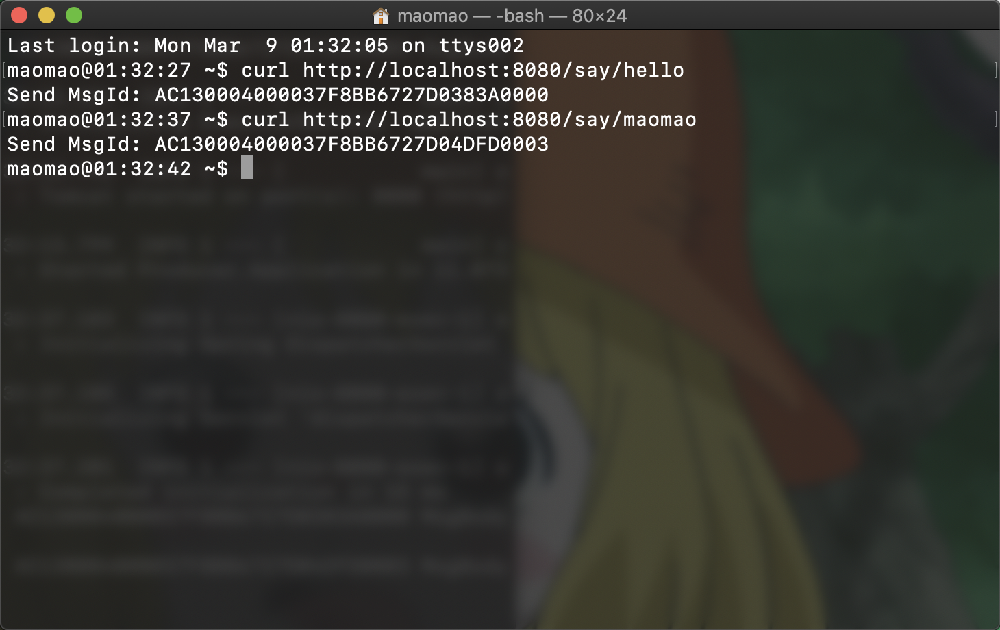
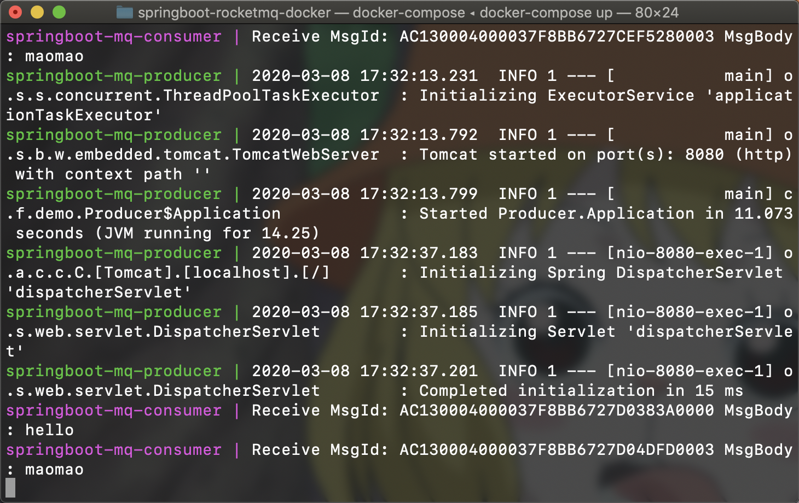

# springboot-rocketmq-docker

Docker Compose 是用于定义和运行多个 Docker Container 的工具。Docker 官方在 [《Get started with Docker Compose》](https://docs.docker.com/compose/gettingstarted/) 文档中，以创建一个基于 [Flask](https://palletsprojects.com/p/flask/) 和 [Redis](https://redis.io/) 的 Python web 应用，为 Docker 新手提供了一个用于学习和实践 Docker Compose 的简单案例。

SpringBoot-RocketMQ-Docker 使用 Docker Compose，创建了一个基于 [Spring Boot](https://spring.io/projects/spring-boot) 和 [Apache RocketMQ](https://rocketmq.apache.org/) 的 Java web 应用，旨在提供更适用于 Java 相关开发人员的 Docker Compose 实践案例。

SpringBoot-RocketMQ-Docker 的业务场景比较简单：**MQ Producer 作为 REST Server，通过 HTTP 协议从客户端中接收消息，并经由 RocketMQ 发送给 MQ Consumer**。消息在 SpringBoot-RocketMQ-Docker 中的流转过程如下：

                   +-------------+           +--------------+           +-------------+
                   |             | --------> | RocketMQ     | <-------- |             |
                   |             | discovery | NameServer   | discovery |             |
                   |             |           +--------------+           |             |
         send msg  | MQ Producer |                ^    ^                | MQ Consumer |
    HTTP --------> |     &&      |   routing info |    |                | (print msg) |
                   | REST Server |                v    v                |             |
                   |             |           +--------------+           |             |
                   |             | send msg  | RocketMQ     | send msg  |             |
                   |             | --------> | BrokerServer | --------> |             |
                   +-------------+           +--------------+           +-------------+

## 前期准备

在开始创建应用之前，需要开发者安装 [Docker Engine](https://docs.docker.com/install/) 和 [Docker Compose](https://docs.docker.com/compose/install/)，以及在开发阶段用于管理依赖和打包项目的 [Maven](https://maven.apache.org/download.cgi) 与用于编译项目和调试代码的 [JDK](https://www.oracle.com/java/technologies/javase/javase-jdk8-downloads.html)，但是无需安装在运行阶段必需的 JRE 和 RocketMQ，因为它们会由 Docker Image 提供。

## 创建应用

<details>
<summary>创建工程</summary>

1. 创建工程目录：

   ```shell
     $ mkdir springboot-rocketmq-docker
     $ cd springboot-rocketmq-docker
   ```

2. 在工程根目录下，创建一个 `pom.xml` 文件，并粘贴以下内容：

   ```xml
   <?xml version="1.0" encoding="UTF-8"?>
   <project xmlns="http://maven.apache.org/POM/4.0.0"
            xmlns:xsi="http://www.w3.org/2001/XMLSchema-instance"
            xsi:schemaLocation="http://maven.apache.org/POM/4.0.0 http://maven.apache.org/xsd/maven-4.0.0.xsd">
       <parent>
           <groupId>org.springframework.boot</groupId>
           <artifactId>spring-boot-starter-parent</artifactId>
           <version>2.2.2.RELEASE</version>
       </parent>
       <modelVersion>4.0.0</modelVersion>

       <groupId>cn.fantasticmao.demo</groupId>
       <artifactId>springboot-rocketmq-docker</artifactId>
       <packaging>pom</packaging>
       <version>1.0-SNAPSHOT</version>

       <modules>
           <module>mq-producer</module>
           <module>mq-consumer</module>
       </modules>

       <build>
           <plugins>
               <plugin>
                   <groupId>org.springframework.boot</groupId>
                   <artifactId>spring-boot-maven-plugin</artifactId>
               </plugin>
           </plugins>
       </build>

       <dependencyManagement>
           <dependencies>
               <dependency>
                   <groupId>org.apache.rocketmq</groupId>
                   <artifactId>rocketmq-spring-boot-starter</artifactId>
                   <version>2.1.0</version>
               </dependency>
           </dependencies>
        </dependencyManagement>
   </project>
   ```

</details>

<details>
<summary>创建模块 mq-producer</summary>

1. 在工程根目录下，创建模块 mq-producer 目录：

   ```shell
    $ mkdir mq-producer
    $ cd mq-producer
   ```

2. 在模块根目录下，创建一个 `pom.xml` 文件，并粘贴以下内容：

   ```xml
   <?xml version="1.0" encoding="UTF-8"?>
   <project xmlns="http://maven.apache.org/POM/4.0.0"
            xmlns:xsi="http://www.w3.org/2001/XMLSchema-instance"
            xsi:schemaLocation="http://maven.apache.org/POM/4.0.0 http://maven.apache.org/xsd/maven-4.0.0.xsd">
       <parent>
           <artifactId>springboot-rocketmq-docker</artifactId>
           <groupId>cn.fantasticmao.demo</groupId>
           <version>1.0-SNAPSHOT</version>
       </parent>
       <modelVersion>4.0.0</modelVersion>

       <artifactId>mq-producer</artifactId>
       <packaging>jar</packaging>

       <dependencies>
           <dependency>
               <groupId>org.springframework.boot</groupId>
               <artifactId>spring-boot-starter-web</artifactId>
           </dependency>

           <dependency>
               <groupId>org.apache.rocketmq</groupId>
               <artifactId>rocketmq-spring-boot-starter</artifactId>
           </dependency>
       </dependencies>
   </project>
   ```

3. 在模块目录下，创建 `src/main/java/cn/fantasticmao/demo/Producer.java` 文件，并粘贴以下内容：

   ```java
   package cn.fantasticmao.demo;

   import org.apache.rocketmq.client.producer.SendResult;
   import org.apache.rocketmq.spring.core.RocketMQTemplate;
   import org.springframework.boot.SpringApplication;
   import org.springframework.boot.autoconfigure.SpringBootApplication;
   import org.springframework.web.bind.annotation.GetMapping;
   import org.springframework.web.bind.annotation.PathVariable;
   import org.springframework.web.bind.annotation.RestController;

   import javax.annotation.Resource;
   import java.nio.charset.StandardCharsets;

   @RestController
   public class Producer {
       @Resource
       private RocketMQTemplate rocketMQTemplate;

       @GetMapping("/say/{msg}")
       public String say(@PathVariable String msg) {
           final byte[] payload = msg.getBytes(StandardCharsets.UTF_8);
           final SendResult sendResult = rocketMQTemplate.syncSend ("springboot-rocketmq-docker", payload);
           return String.format("Send MsgId: %s%n", sendResult.getMsgId());
       }

       @SpringBootApplication
       public static class Application {

           public static void main(String[] args) {
               SpringApplication.run(Application.class, args);
           }
       }
   }
   ```

4. 在模块目录下，创建 `src/main/resources/application.yml` 文件，并粘贴以下内容：

   ```yml
   rocketmq:
     name-server: name-server:9876
     producer:
       group: producer
   ```

</details>

<details>
<summary>创建模块 mq-consumer</summary>

1. 在工程根目录下，创建模块 mq-consumer 目录：

   ```shell
    $ mkdir mq-consumer
    $ cd mq-consumer
   ```

2. 在模块根目录下，创建一个 `pom.xml` 文件，并粘贴以下内容：

   ```xml
   <?xml version="1.0" encoding="UTF-8"?>
   <project xmlns="http://maven.apache.org/POM/4.0.0"
            xmlns:xsi="http://www.w3.org/2001/XMLSchema-instance"
            xsi:schemaLocation="http://maven.apache.org/POM/4.0.0 http://maven.apache.org/xsd/maven-4.0.0.xsd">
       <parent>
           <artifactId>springboot-rocketmq-docker</artifactId>
           <groupId>cn.fantasticmao.demo</groupId>
           <version>1.0-SNAPSHOT</version>
       </parent>
       <modelVersion>4.0.0</modelVersion>

       <artifactId>mq-consumer</artifactId>
       <packaging>jar</packaging>

       <dependencies>
           <dependency>
               <groupId>org.apache.rocketmq</groupId>
               <artifactId>rocketmq-spring-boot-starter</artifactId>
           </dependency>
       </dependencies>
   </project>
   ```

3. 在模块目录下，创建 `src/main/java/cn/fantasticmao/demo/Consumer.java` 文件，并粘贴以下内容：

   ```java
   package cn.fantasticmao.demo;

   import org.apache.rocketmq.common.message.MessageExt;
   import org.apache.rocketmq.spring.annotation.RocketMQMessageListener;
   import org.apache.rocketmq.spring.core.RocketMQListener;
   import org.springframework.boot.SpringApplication;
   import org.springframework.boot.autoconfigure.SpringBootApplication;
   import org.springframework.stereotype.Service;

   import java.nio.charset.StandardCharsets;

   @Service
   @RocketMQMessageListener(consumerGroup = "consumer", topic = "springboot-rocketmq-docker")
   public class Consumer implements RocketMQListener<MessageExt> {

       @Override
       public void onMessage(MessageExt message) {
           final String msgId = message.getMsgId();
           final String msgBody = new String(message.getBody(), StandardCharsets.UTF_8);
           System.out.printf("Receive MsgId: %s MsgBody: %s%n", msgId, msgBody);
       }

       @SpringBootApplication
       public static class Application {

           public static void main(String[] args) {
               SpringApplication.run(Consumer.class, args);
           }
       }
   }
   ```

4. 在模块目录下，创建 `src/main/resources/application.yml` 文件，并粘贴以下内容：

   ```yml
   rocketmq:
     name-server: name-server:9876
   ```

</details>

## 编写 Dockerfile

<details>
<summary>创建 mq-producer/Dockerfile</summary>

在模块 mq-producer 根目录下，创建 `Dockerfile` 文件，并粘贴以下内容：

```dockerfile
FROM openjdk:8-jdk-alpine
ARG JAR_FILE=target/*.jar
WORKDIR /opt/app/
COPY ./${JAR_FILE} producer.jar
EXPOSE 8080
CMD java -jar producer.jar
```

</details>

<details>
<summary>创建 mq-consumer/Dockerfile</summary>

在模块 mq-consumer 根目录下，创建 `Dockerfile` 文件，并粘贴以下内容：

```dockerfile
FROM openjdk:8-jdk-alpine
ARG JAR_FILE=target/*.jar
WORKDIR /opt/app/
COPY ./${JAR_FILE} consumer.jar
CMD java -jar consumer.jar
```

</details>

## 编写 docker-compose.yml

<details>
<summary>创建 docker-compose.yml</summary>

在工程根目录下，创建 `docker-compose.yml` 文件，并指定 Compose 文件格式的版本：

```yml
version: "3.7"
```

</details>

<details>
<summary>定义 network: springboot-rocketmq-docker</summary>

在工程根目录的 `docker-compose.yml` 文件中，显式定义一个 network，用于连接后续定义的各个 Service：

```yml
networks:
  springboot-rocketmq-docker:
    name: springboot-rocketmq-docker
    driver: bridge
```

</details>

<details>
<summary>定义 service: rocketmq-name-server</summary>

在工程根目录的 `docker-compose.yml` 文件中，定义 RocketMQ NameServer 的 Service:

```yml
services:
  name-server:
    image: rocketmqinc/rocketmq:4.4.0
    container_name: rocketmq-name-server
    ports:
      - "9876:9876"
    command: sh mqnamesrv
    networks:
      - springboot-rocketmq-docker
```

</details>

<details>
<summary>定义 service: rocketmq-broker-server</summary>

在工程根目录的 `docker-compose.yml` 文件中，定义 RocketMQ BrokerServer 的 Service:

```yml
services:
  broker-server:
    image: rocketmqinc/rocketmq:4.4.0
    container_name: rocketmq-broker-server
    ports:
      - "10909:10909"
      - "10911:10911"
      - "10912:10912"
    command: sh mqbroker -n name-server:9876
    networks:
      - springboot-rocketmq-docker
    depends_on:
      - name-server
```

</details>

<details>
<summary>定义 service: springboot-mq-producer</summary>

在工程根目录的 `docker-compose.yml` 文件中，定义 mq-produce 模块的 Service:

```yml
services:
  producer:
    build:
      context: ./mq-producer
    image: springboot-rocketmq-producer
    container_name: springboot-mq-producer
    ports:
      - "8080:8080"
    networks:
      - springboot-rocketmq-docker
    depends_on:
      - broker-server
```

</details>

<details>
<summary>定义 service: springboot-mq-consumer</summary>

在工程根目录的 `docker-compose.yml` 文件中，定义 mq-consumer 模块的 Service:

```yml
services:
  consumer:
    build:
      context: ./mq-consumer
    image: springboot-rocketmq-consumer
    container_name: springboot-mq-consumer
    networks:
      - springboot-rocketmq-docker
    depends_on:
      - producer
```

</details>

## 打包项目，构建和运行应用

<details>
<summary>使用 Maven 打包项目</summary>

在工程根目录下，运行以下 Maven 命令，用于打包 mq-producer 和 mq-consumer 两个模块：

```shell
$ mvn clean package
```

</details>

<details>
<summary>使用 Docker Compose 构建和运行应用</summary>

在工程根目录下，运行以下 Docker Compose 命令，用于启动应用：

```shell
$ docker-compose up
```

也可以通过运行以下 Docker Compose 命令，用于以后台运行的方式启动应用，和列出正在运行的 Docker Service：

```shell
$ docker-compose up -d
Creating rocketmq-name-server ... done
Creating rocketmq-broker-server ... done
Creating springboot-mq-producer ... done
Creating springboot-mq-consumer ... done
$ docker-compose ps
         Name                       Command               State                                           Ports
--------------------------------------------------------------------------------------------------------------------------------------------------------
rocketmq-broker-server   sh mqbroker -n name-server ...   Up      0.0.0.0:10909->10909/tcp, 0.0.0.0:10911->10911/tcp, 0.0.0.0:10912->10912/tcp, 9876/tcp
rocketmq-name-server     sh mqnamesrv                     Up      10909/tcp, 10911/tcp, 0.0.0.0:9876->9876/tcp
springboot-mq-consumer   /bin/sh -c java -jar consu ...   Up
springboot-mq-producer   /bin/sh -c java -jar produ ...   Up      0.0.0.0:8080->8080/tcp
```

</details>

## 预览效果

1. 通过 HTTP 协议，向作为 REST Server 的 MQ Producer 发送消息：

   

2. 消息经由 RocketMQ 发送给 MQ Consumer 消费，并打印至控制台：

   
